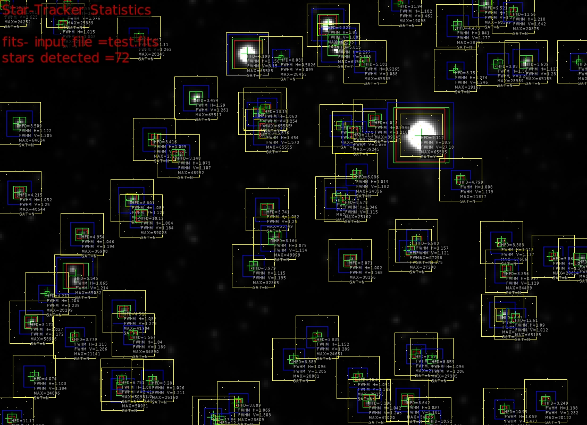

# pybind11 wrapper for C++ star-tracker

Wrapper for Carsten Schmitt's star-tracker

https://www.lost-infinity.com/category/automatic-star-recognizer/

Carsten's repo

https://github.com/carsten0x51h/star_recognizer

# Instructions:

cmake CMakeLists.txt
make

To distribute:

make clean-all

# Python integration:

pip3 install pycimg
pip3 install astropy
pip3 install matplotlib

python3
from py_run_startracker import tracker
tracker("test.fits")

# Output

root@dmoloney-MOBL1:/mnt/c/Users/dmoloney/Desktop/MyGithub/StarSee/star_tracker# python3
Python 3.8.2 (default, Jul 16 2020, 14:00:26)
[GCC 9.3.0] on linux
Type "help", "copyright", "credits" or "license" for more information.
>>> from py_run_startracker import tracker
>>> tracker("test.fits")
Opening file test.fits
)calculating binary image using max_entropy thresholding
numBins=256, min=11162.3, max=65535, img-dim (w x h)=276 x 200
first_bin_idx: 0, last_bin_idx: 255
threshold: 36, th2: 18808.4
Recognized 72 stars...
0 cogCentroid=(   2.2308,   2.16693), , maxPixValue:  24252.6, sat: 0, hfd:     10.808, fwhmHorz:    1.60129, fwhmVert:     1.6226
1 cogCentroid=(   5.4609,   196.762), , maxPixValue:  20416.9, sat: 0, hfd:     11.165, fwhmHorz:    1.91164, fwhmVert:    1.51848
2 cogCentroid=(  8.94504,   58.0188), , maxPixValue:  64624.3, sat: 0, hfd:    3.50907, fwhmHorz:    1.12182, fwhmVert:    1.20497
3 cogCentroid=(  9.19936,   90.4657), , maxPixValue:  40544.5, sat: 0, hfd:     4.2146, fwhmHorz:     1.0519, fwhmVert:    1.25004
4 cogCentroid=(  14.5242,   151.495), , maxPixValue:  53906.5, sat: 0, hfd:    3.17248, fwhmHorz:    1.02702, fwhmVert:    1.17224
5 cogCentroid=(  15.9948,   177.046), , maxPixValue:  24096.4, sat: 0, hfd:    4.07374, fwhmHorz:    1.10283, fwhmVert:    1.18389
6 cogCentroid=(  21.9831,   138.013), , maxPixValue:  20299.5, sat: 0, hfd:    4.27682, fwhmHorz:    1.20349, fwhmVert:    1.23907
7 cogCentroid=(  29.4482,   11.6037), , maxPixValue:  25339.4, sat: 0, hfd:     9.2779, fwhmHorz:    1.01502, fwhmVert:    1.00291
8 cogCentroid=(  31.7118,   2.78652), , maxPixValue:  25339.4, sat: 0, hfd:    11.5508, fwhmHorz:    1.17998, fwhmVert:    1.37588
9 cogCentroid=(  35.4282,   129.853), , maxPixValue:    65032, sat: 0, hfd:    5.54501, fwhmHorz:    1.06508, fwhmVert:    1.21397
10 cogCentroid=(   35.065,    158.58), , maxPixValue:  21141.9, sat: 0, hfd:    3.77888, fwhmHorz:     1.1133, fwhmVert:    1.28588
11 cogCentroid=(  38.4785,   110.228), , maxPixValue:  36900.8, sat: 0, hfd:    4.95419, fwhmHorz:    1.04583, fwhmVert:    1.19396
12 cogCentroid=(   57.493,   183.088), , maxPixValue:  50931.4, sat: 0, hfd:    6.29905, fwhmHorz:    1.10535, fwhmVert:    3.43452
13 cogCentroid=(  58.2107,   146.378), , maxPixValue:  41904.1, sat: 0, hfd:     4.5657, fwhmHorz:    1.03222, fwhmVert:    1.27297
14 cogCentroid=(  57.1505,   178.772), , maxPixValue:  50931.4, sat: 0, hfd:    6.75061, fwhmHorz:    1.08019, fwhmVert:    3.41061
15 cogCentroid=(  61.9226,   94.1285), , maxPixValue:  59023.8, sat: 0, hfd:    8.80096, fwhmHorz:    1.08156, fwhmVert:    1.12199
16 cogCentroid=(  62.4402,   157.504), , maxPixValue:  34890.9, sat: 0, hfd:    3.56729, fwhmHorz:    1.03994, fwhmVert:    1.18938
17 cogCentroid=(  65.1714,   17.4675), , maxPixValue:  20243.5, sat: 0, hfd:    3.68652, fwhmHorz:    1.10973, fwhmVert:    1.26221
18 cogCentroid=(  66.2657,   101.415), , maxPixValue:  59023.8, sat: 0, hfd:    10.1181, fwhmHorz:    1.00396, fwhmVert:    1.18427
19 cogCentroid=(  71.5727,   178.947), , maxPixValue:  26160.7, sat: 0, hfd:    3.27959, fwhmHorz:    1.02565, fwhmVert:    1.21057
20 cogCentroid=(  72.5199,   65.4948), , maxPixValue:  27285.6, sat: 0, hfd:    3.41629, fwhmHorz:    1.09548, fwhmVert:    1.32092
21 cogCentroid=(  83.6713,   73.3675), , maxPixValue:  48992.9, sat: 0, hfd:    3.14782, fwhmHorz:    1.07295, fwhmVert:     1.1072
22 cogCentroid=(  92.0161,   45.8827), , maxPixValue:  65517.4, sat: 0, hfd:    3.49415, fwhmHorz:    1.29036, fwhmVert:    1.26096
23 cogCentroid=(  100.223,   196.341), , maxPixValue:  25281.6, sat: 0, hfd:    11.8354, fwhmHorz:    3.69665, fwhmVert:    1.80383
24 cogCentroid=(  103.237,   197.798), , maxPixValue:  25281.6, sat: 0, hfd:    12.0976, fwhmHorz:    1.83109, fwhmVert:   0.465124
25 cogCentroid=(  116.141,   25.2071), , maxPixValue:    65535, sat: 1, hfd:    6.19786, fwhmHorz:     3.1563, fwhmVert:    3.14988
26 cogCentroid=(  112.087,   189.514), , maxPixValue:  23609.1, sat: 0, hfd:    3.80907, fwhmHorz:    1.06899, fwhmVert:    1.30315
27 cogCentroid=(    119.1,   125.037), , maxPixValue:    32365, sat: 0, hfd:    3.97911, fwhmHorz:    1.11453, fwhmVert:    1.19532
28 cogCentroid=(  121.928,   53.3239), , maxPixValue:    65535, sat: 1, hfd:    13.1156, fwhmHorz:   0.956019, fwhmVert:    1.03933
29 cogCentroid=(   125.28,   61.3716), , maxPixValue:    65535, sat: 1, hfd:    5.67555, fwhmHorz:    1.45379, fwhmVert:    1.57305
30 cogCentroid=(  125.399,   98.5989), , maxPixValue:  33749.8, sat: 0, hfd:    3.74121, fwhmHorz:    1.08195, fwhmVert:    1.24965
31 cogCentroid=(  124.463,   51.2747), , maxPixValue:    65535, sat: 1, hfd:    13.1465, fwhmHorz:    1.06346, fwhmVert:    1.25425
32 cogCentroid=(  128.877,   112.095), , maxPixValue:  49999.7, sat: 0, hfd:    3.16426, fwhmHorz:    1.07854, fwhmVert:    1.13382
33 cogCentroid=(  131.997,   26.9318), , maxPixValue:  26453.8, sat: 0, hfd:    8.03295, fwhmHorz:   0.582638, fwhmVert:    1.09545
34 cogCentroid=(    138.1,     169.1), , maxPixValue:  28001.7, sat: 0, hfd:    3.38934, fwhmHorz:    1.09612, fwhmVert:    1.20498
35 cogCentroid=(   149.09,   158.567), , maxPixValue:  24651.6, sat: 0, hfd:    3.83529, fwhmHorz:    1.15196, fwhmVert:     1.2886
36 cogCentroid=(  154.321,   11.7206), , maxPixValue:    65535, sat: 1, hfd:    9.32698, fwhmHorz:    1.88029, fwhmVert:    1.80467
37 cogCentroid=(   158.97,   21.0487), , maxPixValue:    65535, sat: 1, hfd:    5.81453, fwhmHorz:    2.29665, fwhmVert:    2.39295
38 cogCentroid=(  158.211,   92.9843), , maxPixValue:  25162.6, sat: 0, hfd:    5.64945, fwhmHorz:    1.00004, fwhmVert:    1.25482
39 cogCentroid=(  160.269,   59.0042), , maxPixValue:  34040.4, sat: 0, hfd:     7.2765, fwhmHorz:    1.02827, fwhmVert:    1.15538
40 cogCentroid=(  162.292,   94.0209), , maxPixValue:  25162.6, sat: 0, hfd:    8.67791, fwhmHorz:    1.34558, fwhmVert:     1.1152
41 cogCentroid=(  164.498,   122.581), , maxPixValue:  38156.2, sat: 0, hfd:    3.07062, fwhmHorz:    1.00181, fwhmVert:    1.16845
42 cogCentroid=(  166.347,   62.3607), , maxPixValue:  39245.4, sat: 0, hfd:    11.2413, fwhmHorz:   0.986498, fwhmVert:    1.09836
43 cogCentroid=(  167.595,   82.0084), , maxPixValue:  24336.1, sat: 0, hfd:    6.03577, fwhmHorz:    1.01947, fwhmVert:    1.18188
44 cogCentroid=(  168.134,   177.498), , maxPixValue:  29153.5, sat: 0, hfd:     10.405, fwhmHorz:    1.09112, fwhmVert:    1.19901
45 cogCentroid=(   171.59,   28.9352), , maxPixValue:    65535, sat: 1, hfd:    5.10074, fwhmHorz:   0.926541, fwhmVert:    1.08792
46 cogCentroid=(  173.413,   188.435), , maxPixValue:  47020.2, sat: 0, hfd:    3.29592, fwhmHorz:    1.04192, fwhmVert:     1.2052
47 cogCentroid=(  176.233,   56.4737), , maxPixValue:  39245.4, sat: 0, hfd:    6.01331, fwhmHorz:   0.994556, fwhmVert:    1.21838
48 cogCentroid=(  197.907,   63.4146), , maxPixValue:    65535, sat: 1, hfd:    9.11228, fwhmHorz:    18.9014, fwhmVert:    27.1847
49 cogCentroid=(  188.037,   1.82896), , maxPixValue:  19098.6, sat: 0, hfd:    11.9352, fwhmHorz:    1.10198, fwhmVert:    1.46177
50 cogCentroid=(  191.497,   188.195), , maxPixValue:  34165.3, sat: 0, hfd:    3.64226, fwhmHorz:     1.0967, fwhmVert:    1.18096
51 cogCentroid=(  192.792,   117.786), , maxPixValue:  27298.5, sat: 0, hfd:     7.7728, fwhmHorz:    1.02446, fwhmVert:    1.17488
52 cogCentroid=(  195.782,   113.191), , maxPixValue:  27298.5, sat: 0, hfd:    6.98275, fwhmHorz:    1.15682, fwhmVert:    1.12063
53 cogCentroid=(  195.495,   166.488), , maxPixValue:  27385.5, sat: 0, hfd:    9.59019, fwhmHorz:    0.96713, fwhmVert:    1.14008
54 cogCentroid=(  202.081,   197.097), , maxPixValue:  33936.2, sat: 0, hfd:    10.9221, fwhmHorz:    1.04362, fwhmVert:    1.12054
55 cogCentroid=(  202.984,   169.042), , maxPixValue:  27385.5, sat: 0, hfd:     8.8587, fwhmHorz:    1.09381, fwhmVert:    1.20636
56 cogCentroid=(  215.016,   11.9519), , maxPixValue:  28731.6, sat: 0, hfd:    4.47311, fwhmHorz:    1.04077, fwhmVert:    1.27683
57 cogCentroid=(  214.054,   32.9334), , maxPixValue:  19167.6, sat: 0, hfd:    3.75029, fwhmHorz:    1.27352, fwhmVert:    1.24648
58 cogCentroid=(  216.518,   84.5793), , maxPixValue:  21877.6, sat: 0, hfd:    4.79939, fwhmHorz:    1.00769, fwhmVert:    1.17931
59 cogCentroid=(  228.031,   2.51062), , maxPixValue:    60510, sat: 0, hfd:     9.5212, fwhmHorz:    1.17615, fwhmVert:    1.29043
60 cogCentroid=(  233.915,   30.1135), , maxPixValue:  23939.7, sat: 0, hfd:    3.83041, fwhmHorz:    1.34084, fwhmVert:    1.28425
61 cogCentroid=(  236.291,   148.168), , maxPixValue:  65185.6, sat: 0, hfd:    4.41018, fwhmHorz:    1.02346, fwhmVert:    1.19658
62 cogCentroid=(  235.676,   114.087), , maxPixValue:    27686, sat: 0, hfd:    3.38326, fwhmHorz:    1.11326, fwhmVert:    1.17697
63 cogCentroid=(  237.972,   127.592), , maxPixValue:  34439.4, sat: 0, hfd:    3.35642, fwhmHorz:   0.997049, fwhmVert:    1.12857
64 cogCentroid=(  237.186,   192.468), , maxPixValue:  23101.4, sat: 0, hfd:    10.9491, fwhmHorz:    1.05862, fwhmVert:    1.47701
65 cogCentroid=(  241.197,   5.42967), , maxPixValue:  20375.6, sat: 0, hfd:    11.5645, fwhmHorz:    1.21846, fwhmVert:    1.64201
66 cogCentroid=(  242.338,   149.536), , maxPixValue:  65185.6, sat: 0, hfd:    12.6072, fwhmHorz:    1.08951, fwhmVert:    1.01165
67 cogCentroid=(  247.161,   29.0553), , maxPixValue:  65155.3, sat: 0, hfd:    3.63881, fwhmHorz:    1.12154, fwhmVert:    1.23148
68 cogCentroid=(  256.483,   188.524), , maxPixValue:  20122.9, sat: 0, hfd:    3.24906, fwhmHorz:    1.13751, fwhmVert:    1.23242
69 cogCentroid=(   260.11,   120.517), , maxPixValue:    20615, sat: 0, hfd:    5.86115, fwhmHorz:    1.08879, fwhmVert:    1.29098
70 cogCentroid=(  272.376,   122.001), , maxPixValue:  57317.6, sat: 0, hfd:    9.10151, fwhmHorz:    1.21287, fwhmVert:    1.15347
71 cogCentroid=(  272.084,   28.9411), , maxPixValue:  19696.9, sat: 0, hfd:    11.7114, fwhmHorz:    1.61175, fwhmVert:    1.36004
0
>>> quit()

Standalone:

./run_startracker test.fits

root@dmoloney-MOBL1:/mnt/c/Users/dmoloney/Desktop/MyGithub/StarSee/star_tracker# ./run_startracker test.fits
Opening file test.fits
)calculating binary image using max_entropy thresholding
numBins=256, min=11162.3, max=65535, img-dim (w x h)=276 x 200
first_bin_idx: 0, last_bin_idx: 255
threshold: 36, th2: 18808.4
Recognized 72 stars...
0 cogCentroid=(   2.2308,   2.16693), , maxPixValue:  24252.6, sat: 0, hfd:     10.808, fwhmHorz:    1.60129, fwhmVert:     1.6226
1 cogCentroid=(   5.4609,   196.762), , maxPixValue:  20416.9, sat: 0, hfd:     11.165, fwhmHorz:    1.91164, fwhmVert:    1.51848
2 cogCentroid=(  8.94504,   58.0188), , maxPixValue:  64624.3, sat: 0, hfd:    3.50907, fwhmHorz:    1.12182, fwhmVert:    1.20497
3 cogCentroid=(  9.19936,   90.4657), , maxPixValue:  40544.5, sat: 0, hfd:     4.2146, fwhmHorz:     1.0519, fwhmVert:    1.25004
4 cogCentroid=(  14.5242,   151.495), , maxPixValue:  53906.5, sat: 0, hfd:    3.17248, fwhmHorz:    1.02702, fwhmVert:    1.17224
5 cogCentroid=(  15.9948,   177.046), , maxPixValue:  24096.4, sat: 0, hfd:    4.07374, fwhmHorz:    1.10283, fwhmVert:    1.18389
6 cogCentroid=(  21.9831,   138.013), , maxPixValue:  20299.5, sat: 0, hfd:    4.27682, fwhmHorz:    1.20349, fwhmVert:    1.23907
7 cogCentroid=(  29.4482,   11.6037), , maxPixValue:  25339.4, sat: 0, hfd:     9.2779, fwhmHorz:    1.01502, fwhmVert:    1.00291
8 cogCentroid=(  31.7118,   2.78652), , maxPixValue:  25339.4, sat: 0, hfd:    11.5508, fwhmHorz:    1.17998, fwhmVert:    1.37588
9 cogCentroid=(  35.4282,   129.853), , maxPixValue:    65032, sat: 0, hfd:    5.54501, fwhmHorz:    1.06508, fwhmVert:    1.21397
10 cogCentroid=(   35.065,    158.58), , maxPixValue:  21141.9, sat: 0, hfd:    3.77888, fwhmHorz:     1.1133, fwhmVert:    1.28588
11 cogCentroid=(  38.4785,   110.228), , maxPixValue:  36900.8, sat: 0, hfd:    4.95419, fwhmHorz:    1.04583, fwhmVert:    1.19396
12 cogCentroid=(   57.493,   183.088), , maxPixValue:  50931.4, sat: 0, hfd:    6.29905, fwhmHorz:    1.10535, fwhmVert:    3.43452
13 cogCentroid=(  58.2107,   146.378), , maxPixValue:  41904.1, sat: 0, hfd:     4.5657, fwhmHorz:    1.03222, fwhmVert:    1.27297
14 cogCentroid=(  57.1505,   178.772), , maxPixValue:  50931.4, sat: 0, hfd:    6.75061, fwhmHorz:    1.08019, fwhmVert:    3.41061
15 cogCentroid=(  61.9226,   94.1285), , maxPixValue:  59023.8, sat: 0, hfd:    8.80096, fwhmHorz:    1.08156, fwhmVert:    1.12199
16 cogCentroid=(  62.4402,   157.504), , maxPixValue:  34890.9, sat: 0, hfd:    3.56729, fwhmHorz:    1.03994, fwhmVert:    1.18938
17 cogCentroid=(  65.1714,   17.4675), , maxPixValue:  20243.5, sat: 0, hfd:    3.68652, fwhmHorz:    1.10973, fwhmVert:    1.26221
18 cogCentroid=(  66.2657,   101.415), , maxPixValue:  59023.8, sat: 0, hfd:    10.1181, fwhmHorz:    1.00396, fwhmVert:    1.18427
19 cogCentroid=(  71.5727,   178.947), , maxPixValue:  26160.7, sat: 0, hfd:    3.27959, fwhmHorz:    1.02565, fwhmVert:    1.21057
20 cogCentroid=(  72.5199,   65.4948), , maxPixValue:  27285.6, sat: 0, hfd:    3.41629, fwhmHorz:    1.09548, fwhmVert:    1.32092
21 cogCentroid=(  83.6713,   73.3675), , maxPixValue:  48992.9, sat: 0, hfd:    3.14782, fwhmHorz:    1.07295, fwhmVert:     1.1072
22 cogCentroid=(  92.0161,   45.8827), , maxPixValue:  65517.4, sat: 0, hfd:    3.49415, fwhmHorz:    1.29036, fwhmVert:    1.26096
23 cogCentroid=(  100.223,   196.341), , maxPixValue:  25281.6, sat: 0, hfd:    11.8354, fwhmHorz:    3.69665, fwhmVert:    1.80383
24 cogCentroid=(  103.237,   197.798), , maxPixValue:  25281.6, sat: 0, hfd:    12.0976, fwhmHorz:    1.83109, fwhmVert:   0.465124
25 cogCentroid=(  116.141,   25.2071), , maxPixValue:    65535, sat: 1, hfd:    6.19786, fwhmHorz:     3.1563, fwhmVert:    3.14988
26 cogCentroid=(  112.087,   189.514), , maxPixValue:  23609.1, sat: 0, hfd:    3.80907, fwhmHorz:    1.06899, fwhmVert:    1.30315
27 cogCentroid=(    119.1,   125.037), , maxPixValue:    32365, sat: 0, hfd:    3.97911, fwhmHorz:    1.11453, fwhmVert:    1.19532
28 cogCentroid=(  121.928,   53.3239), , maxPixValue:    65535, sat: 1, hfd:    13.1156, fwhmHorz:   0.956019, fwhmVert:    1.03933
29 cogCentroid=(   125.28,   61.3716), , maxPixValue:    65535, sat: 1, hfd:    5.67555, fwhmHorz:    1.45379, fwhmVert:    1.57305
30 cogCentroid=(  125.399,   98.5989), , maxPixValue:  33749.8, sat: 0, hfd:    3.74121, fwhmHorz:    1.08195, fwhmVert:    1.24965
31 cogCentroid=(  124.463,   51.2747), , maxPixValue:    65535, sat: 1, hfd:    13.1465, fwhmHorz:    1.06346, fwhmVert:    1.25425
32 cogCentroid=(  128.877,   112.095), , maxPixValue:  49999.7, sat: 0, hfd:    3.16426, fwhmHorz:    1.07854, fwhmVert:    1.13382
33 cogCentroid=(  131.997,   26.9318), , maxPixValue:  26453.8, sat: 0, hfd:    8.03295, fwhmHorz:   0.582638, fwhmVert:    1.09545
34 cogCentroid=(    138.1,     169.1), , maxPixValue:  28001.7, sat: 0, hfd:    3.38934, fwhmHorz:    1.09612, fwhmVert:    1.20498
35 cogCentroid=(   149.09,   158.567), , maxPixValue:  24651.6, sat: 0, hfd:    3.83529, fwhmHorz:    1.15196, fwhmVert:     1.2886
36 cogCentroid=(  154.321,   11.7206), , maxPixValue:    65535, sat: 1, hfd:    9.32698, fwhmHorz:    1.88029, fwhmVert:    1.80467
37 cogCentroid=(   158.97,   21.0487), , maxPixValue:    65535, sat: 1, hfd:    5.81453, fwhmHorz:    2.29665, fwhmVert:    2.39295
38 cogCentroid=(  158.211,   92.9843), , maxPixValue:  25162.6, sat: 0, hfd:    5.64945, fwhmHorz:    1.00004, fwhmVert:    1.25482
39 cogCentroid=(  160.269,   59.0042), , maxPixValue:  34040.4, sat: 0, hfd:     7.2765, fwhmHorz:    1.02827, fwhmVert:    1.15538
40 cogCentroid=(  162.292,   94.0209), , maxPixValue:  25162.6, sat: 0, hfd:    8.67791, fwhmHorz:    1.34558, fwhmVert:     1.1152
41 cogCentroid=(  164.498,   122.581), , maxPixValue:  38156.2, sat: 0, hfd:    3.07062, fwhmHorz:    1.00181, fwhmVert:    1.16845
42 cogCentroid=(  166.347,   62.3607), , maxPixValue:  39245.4, sat: 0, hfd:    11.2413, fwhmHorz:   0.986498, fwhmVert:    1.09836
43 cogCentroid=(  167.595,   82.0084), , maxPixValue:  24336.1, sat: 0, hfd:    6.03577, fwhmHorz:    1.01947, fwhmVert:    1.18188
44 cogCentroid=(  168.134,   177.498), , maxPixValue:  29153.5, sat: 0, hfd:     10.405, fwhmHorz:    1.09112, fwhmVert:    1.19901
45 cogCentroid=(   171.59,   28.9352), , maxPixValue:    65535, sat: 1, hfd:    5.10074, fwhmHorz:   0.926541, fwhmVert:    1.08792
46 cogCentroid=(  173.413,   188.435), , maxPixValue:  47020.2, sat: 0, hfd:    3.29592, fwhmHorz:    1.04192, fwhmVert:     1.2052
47 cogCentroid=(  176.233,   56.4737), , maxPixValue:  39245.4, sat: 0, hfd:    6.01331, fwhmHorz:   0.994556, fwhmVert:    1.21838
48 cogCentroid=(  197.907,   63.4146), , maxPixValue:    65535, sat: 1, hfd:    9.11228, fwhmHorz:    18.9014, fwhmVert:    27.1847
49 cogCentroid=(  188.037,   1.82896), , maxPixValue:  19098.6, sat: 0, hfd:    11.9352, fwhmHorz:    1.10198, fwhmVert:    1.46177
50 cogCentroid=(  191.497,   188.195), , maxPixValue:  34165.3, sat: 0, hfd:    3.64226, fwhmHorz:     1.0967, fwhmVert:    1.18096
51 cogCentroid=(  192.792,   117.786), , maxPixValue:  27298.5, sat: 0, hfd:     7.7728, fwhmHorz:    1.02446, fwhmVert:    1.17488
52 cogCentroid=(  195.782,   113.191), , maxPixValue:  27298.5, sat: 0, hfd:    6.98275, fwhmHorz:    1.15682, fwhmVert:    1.12063
53 cogCentroid=(  195.495,   166.488), , maxPixValue:  27385.5, sat: 0, hfd:    9.59019, fwhmHorz:    0.96713, fwhmVert:    1.14008
54 cogCentroid=(  202.081,   197.097), , maxPixValue:  33936.2, sat: 0, hfd:    10.9221, fwhmHorz:    1.04362, fwhmVert:    1.12054
55 cogCentroid=(  202.984,   169.042), , maxPixValue:  27385.5, sat: 0, hfd:     8.8587, fwhmHorz:    1.09381, fwhmVert:    1.20636
56 cogCentroid=(  215.016,   11.9519), , maxPixValue:  28731.6, sat: 0, hfd:    4.47311, fwhmHorz:    1.04077, fwhmVert:    1.27683
57 cogCentroid=(  214.054,   32.9334), , maxPixValue:  19167.6, sat: 0, hfd:    3.75029, fwhmHorz:    1.27352, fwhmVert:    1.24648
58 cogCentroid=(  216.518,   84.5793), , maxPixValue:  21877.6, sat: 0, hfd:    4.79939, fwhmHorz:    1.00769, fwhmVert:    1.17931
59 cogCentroid=(  228.031,   2.51062), , maxPixValue:    60510, sat: 0, hfd:     9.5212, fwhmHorz:    1.17615, fwhmVert:    1.29043
60 cogCentroid=(  233.915,   30.1135), , maxPixValue:  23939.7, sat: 0, hfd:    3.83041, fwhmHorz:    1.34084, fwhmVert:    1.28425
61 cogCentroid=(  236.291,   148.168), , maxPixValue:  65185.6, sat: 0, hfd:    4.41018, fwhmHorz:    1.02346, fwhmVert:    1.19658
62 cogCentroid=(  235.676,   114.087), , maxPixValue:    27686, sat: 0, hfd:    3.38326, fwhmHorz:    1.11326, fwhmVert:    1.17697
63 cogCentroid=(  237.972,   127.592), , maxPixValue:  34439.4, sat: 0, hfd:    3.35642, fwhmHorz:   0.997049, fwhmVert:    1.12857
64 cogCentroid=(  237.186,   192.468), , maxPixValue:  23101.4, sat: 0, hfd:    10.9491, fwhmHorz:    1.05862, fwhmVert:    1.47701
65 cogCentroid=(  241.197,   5.42967), , maxPixValue:  20375.6, sat: 0, hfd:    11.5645, fwhmHorz:    1.21846, fwhmVert:    1.64201
66 cogCentroid=(  242.338,   149.536), , maxPixValue:  65185.6, sat: 0, hfd:    12.6072, fwhmHorz:    1.08951, fwhmVert:    1.01165
67 cogCentroid=(  247.161,   29.0553), , maxPixValue:  65155.3, sat: 0, hfd:    3.63881, fwhmHorz:    1.12154, fwhmVert:    1.23148
68 cogCentroid=(  256.483,   188.524), , maxPixValue:  20122.9, sat: 0, hfd:    3.24906, fwhmHorz:    1.13751, fwhmVert:    1.23242
69 cogCentroid=(   260.11,   120.517), , maxPixValue:    20615, sat: 0, hfd:    5.86115, fwhmHorz:    1.08879, fwhmVert:    1.29098
70 cogCentroid=(  272.376,   122.001), , maxPixValue:  57317.6, sat: 0, hfd:    9.10151, fwhmHorz:    1.21287, fwhmVert:    1.15347
71 cogCentroid=(  272.084,   28.9411), , maxPixValue:  19696.9, sat: 0, hfd:    11.7114, fwhmHorz:    1.61175, fwhmVert:    1.36004

